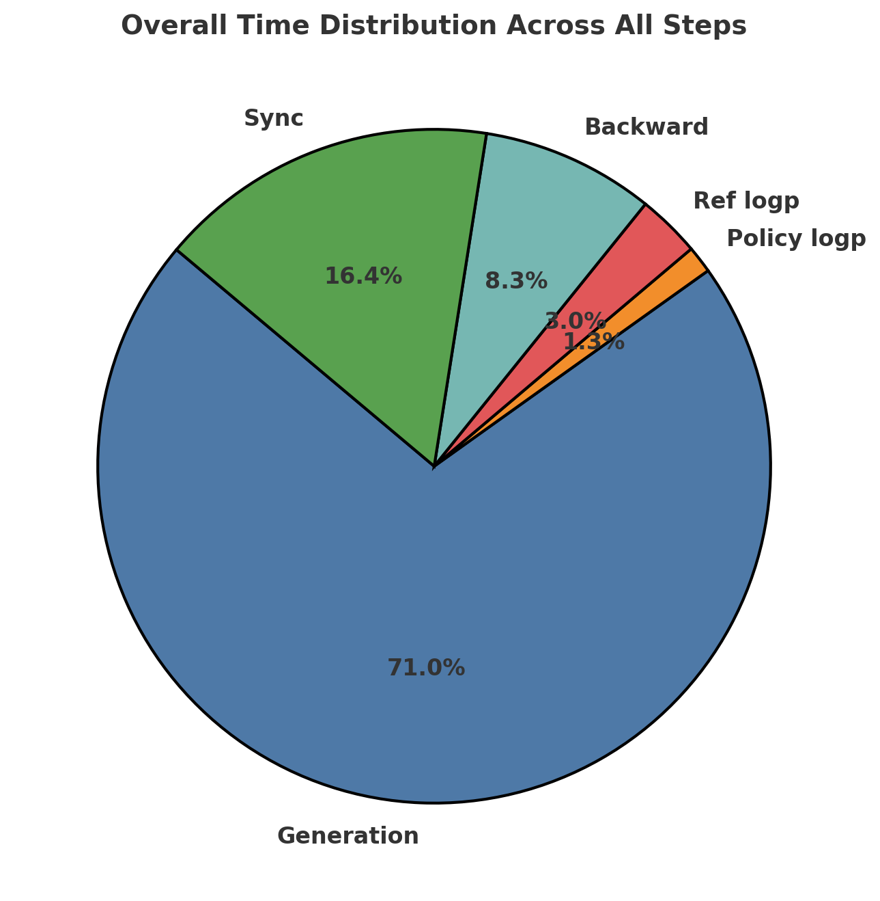

### Why Minimal-R1?

I aimed to reproduce the original [R1 paper](https://github.com/deepseek-ai/DeepSeek-R1) using only an **8x H100 server**. However, during development, I encountered some limitations with open-r1 (though these may have been resolved now):

- **Token Generation Limit**: Open-r1 could not generate more than **256 completion tokens**, even with a 7B model. Since long-CoT (Chain-of-Thought) reasoning is a key novelty of R1, **long-form generation is essential**.
- **DeepSpeed ZeRO-3 Incompatibility**: Open-r1 did not work with **DeepSpeed ZeRO-3**, likely due to issues within `trl`.
- **Separated Generation & Reference Models**: Unlike open-r1, **Minimal-R1 runs generation and reference models on separate GPUs**, improving efficiency and scalability.

### GPU Allocation in Minimal-R1

| GPU        | Function      |
|------------|--------------|
| **gpu0-1**   | Generation   |
| **gpu2**   | Reference    |
| **gpu3–7** | Policy       |

By **separating generation and reference models**, Minimal-R1 ensures more efficient memory usage and parallel processing, optimizing the training workflow.

---

### How to Run

1) Install requirements

```bash
pip install -r requirements.txt
```

2) Launch the **vLLM server** and **reference model server**:

```bash
CUDA_VISIBLE_DEVICES=0,1 nohup python3 minimal_r1/launch_vllm.py --model_name Seungyoun/Qwen2.5-7B-Open-R1-Distill & > vllm.log &
CUDA_VISIBLE_DEVICES=2 nohup python3 minimal_r1/launch_ref_model.py --model_name Seungyoun/Qwen2.5-7B-Open-R1-Distill & > ref_model.log &
```

3) Then, start the training script:

```bash
CUDA_VISIBLE_DEVICES=3,4,5,6,7 nohup accelerate launch --config_file ./configs/zero3.yaml minimal_r1/train_grpo.py --max_tokens 4096 & > train.log &
```

This setup enables efficient training while addressing the original open-r1 limitations. 🚀

---

### Performance Analysis and Optimization

Below is a pie chart visualizing the **overall time distribution across all steps** during the training process:



As seen in the chart, the **generation step dominates the overall runtime, accounting for 71.0% of the time**. Given this, allocating more GPUs to the generation process could potentially improve efficiency and reduce the bottleneck. This adjustment may lead to faster training and better resource utilization, especially when handling long-form generation tasks.

---

# xDAN-RLAIF-GRPO

使用GRPO (Generative Reward Proximal Optimization)训练大语言模型的分布式训练框架。

## 特点

- 分布式训练支持（DeepSpeed + Accelerate）
- 多GPU张量并行推理（vLLM）
- 完整的训练、生成和评估流程
- 灵活的配置系统

## 系统要求

- Python 3.8+
- CUDA 11.7+
- 至少3个GPU节点（训练、生成、参考）

## 快速开始

1. 配置节点（编辑`config/nodes.yaml`）：
```yaml
training:
  master_node: "gpu007"
  services:
    generation:
      url: "http://gpu004:8000"
    reference:
      url: "http://gpu008:8001"
```

2. 启动服务：
```bash
# 在gpu004上启动vLLM生成服务
CUDA_VISIBLE_DEVICES=0,1,2,3,4,5,6,7 python src/launch_vllm.py \
    --model_path /path/to/model \
    --port 8000 \
    --tensor_parallel_size 8

# 在gpu008上启动参考模型服务
CUDA_VISIBLE_DEVICES=0,1,2,3,4,5,6,7 python src/launch_ref_model.py \
    --model_path /path/to/model \
    --port 8001 \
    --tensor_parallel_size 8
```

3. 启动训练：
```bash
./scripts/launch_distributed.sh
```

## 目录结构

```
项目根目录/
├── config/
│   ├── nodes.yaml      # 节点和模型配置
│   ├── hostfile        # DeepSpeed训练节点配置
│   └── accelerate_config.yaml  # Accelerate配置
├── src/
│   ├── train_grpo.py   # 训练主脚本
│   ├── launch_vllm.py  # vLLM服务启动脚本
│   └── launch_ref_model.py  # 参考模型服务启动脚本
├── scripts/
│   ├── launch_distributed.sh  # 分布式训练启动脚本
│   └── launch_training.sh     # 训练启动脚本
└── output/             # 训练输出目录
    ├── checkpoints/   # 模型检查点
    └── logs/         # 训练日志
```

## 训练配置

主要训练参数（在`launch_training.sh`中配置）：
- `--dataset_name`: 训练数据集名称
- `--epochs`: 训练轮数
- `--batch_size`: 批次大小
- `--lr`: 学习率
- `--beta`: KL惩罚系数
- `--temperature`: 采样温度
- `--num_gen`: 每个prompt生成的样本数
- `--max_tokens`: 最大生成长度

## 注意事项

1. 确保所有节点都能相互访问
2. 确保模型路径在所有节点上都存在
3. 确保所有节点的CUDA环境正确配置
4. 使用相对路径进行输出，便于跨节点共享